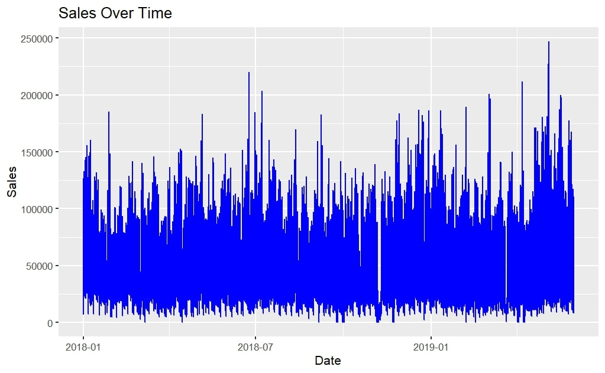
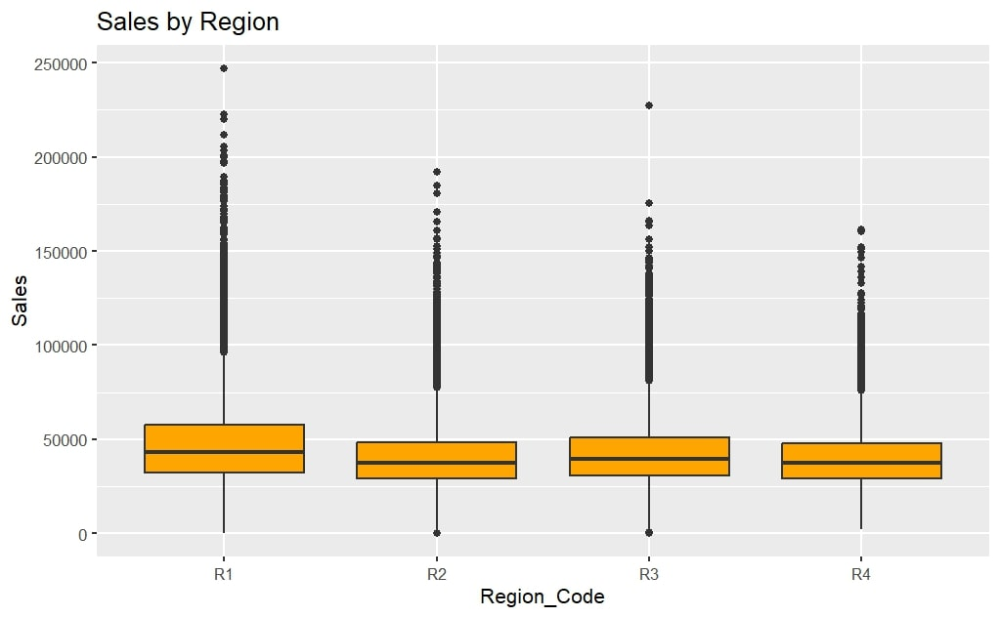
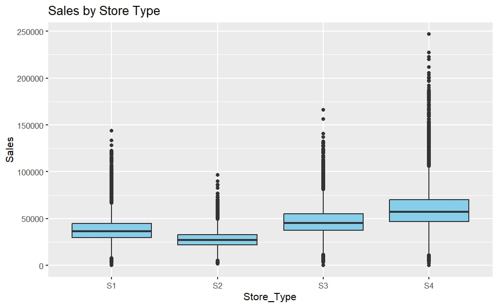
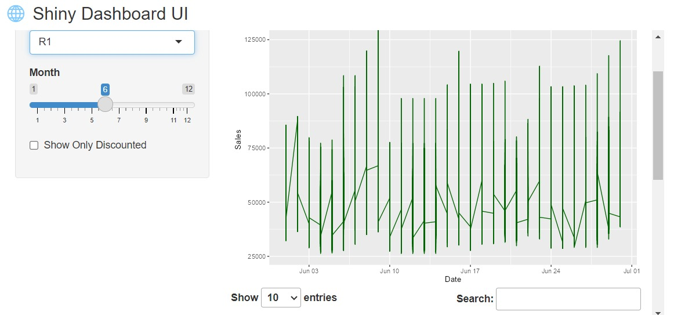
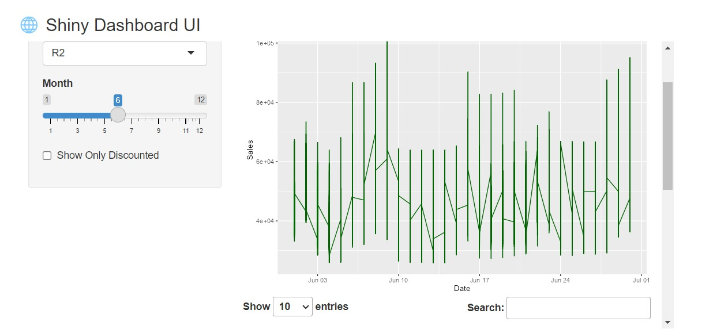
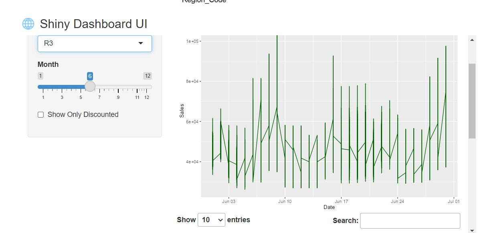
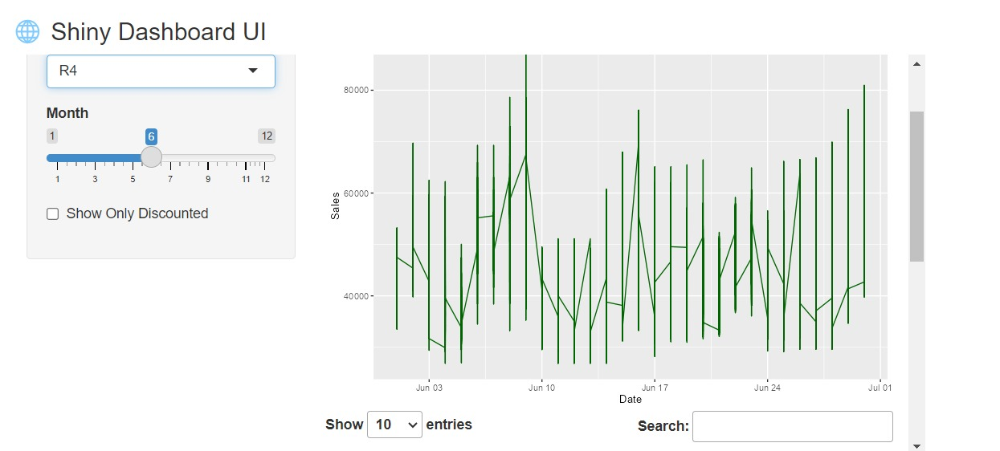

# WOMart Sales Forecasting Capstone

Retail forecasting and decision-support project for predicting daily sales across a health and nutritional supplement retail chain.

## Portfolio Summary

This capstone project builds a forecasting workflow that combines machine learning, classical time-series baselines, business interpretation, and dashboard-ready outputs. The goal is to support inventory planning, regional decision-making, and promotion strategy.

## Business Problem

Retail teams need reliable forward-looking sales estimates to reduce overstocking, avoid stockouts, and plan promotions. This project focuses on store-level and regional forecasting so operational decisions can be made with clearer demand signals.

## Methods

Models and techniques used:

- XGBoost
- LightGBM
- ARIMA benchmarks
- Feature engineering for retail demand patterns
- Model comparison with forecast-error metrics
- Interactive dashboard delivery through R Shiny

## Key Features

- Store-level and regional sales forecasting
- 61-day forward-looking predictions
- Ensemble modeling workflow
- Benchmark time-series models
- Interactive R Shiny dashboard for decision support
- Business recommendations for inventory and planning

## Tools

R, data.table, xgboost, lightgbm, caret, lubridate, ARIMA, R Shiny, Power BI.

## Deliverables

- [Final Report](report/Sairam-Jammu-Capstone-Project-report.pdf)
- [Capstone Presentation](presentation/Sairam-Jammu-Capstone-Presentation.pdf)
- Modeling and analysis files in the `rmarkdown/` folder
- Training, test, and sample submission files in the `data/` folder

## Repository Structure

| Folder | Contents |
| --- | --- |
| `data/` | Source CSV files for model training, testing, and submission format. |
| `presentation/` | Final capstone presentation. |
| `report/` | Final capstone project report. |
| `rmarkdown/` | R Markdown analysis and dashboard source. |
| `screenshots/` | Reviewed plots and Shiny dashboard screenshots. |

## Visual Evidence

### Sales Trend

The sales trend shows frequent spikes and changing demand patterns across the 2018-2019 period, supporting the use of calendar, holiday, region, discount, and store-level features.

### Segment Comparisons

The boxplots show meaningful differences by region and store type. Store type S4 has the strongest central sales level and wider upper range, while regional sales include high-value outliers that are important for model evaluation.

### Shiny Dashboard Screenshots

| Region R1 | Region R2 |
| --- | --- |
|  |  |

| Region R3 | Region R4 |
| --- | --- |
|  |  |

The dashboard views show region filtering, month selection, discount filtering, sales trend visualization, and searchable tabular output.

## Portfolio Value

This project demonstrates the full analytics workflow: business framing, data preparation, model development, dashboard delivery, and communication of operational impact.

## Author

Sairam Jammu  
M.S. Business Analytics, Kent State University
