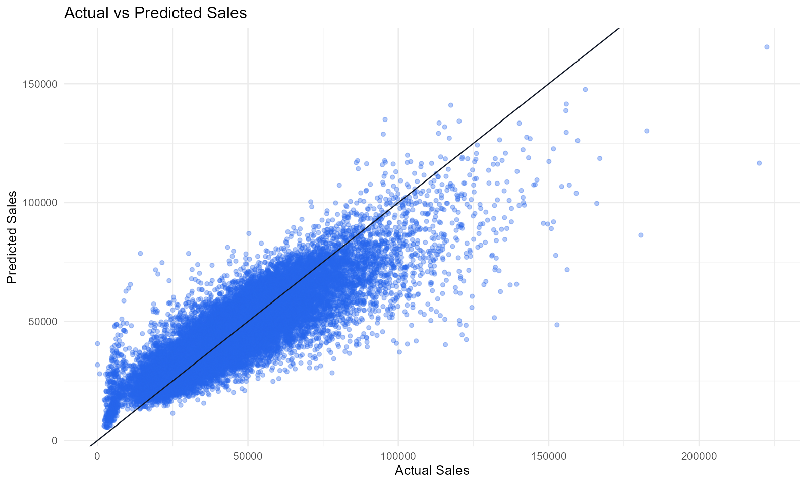
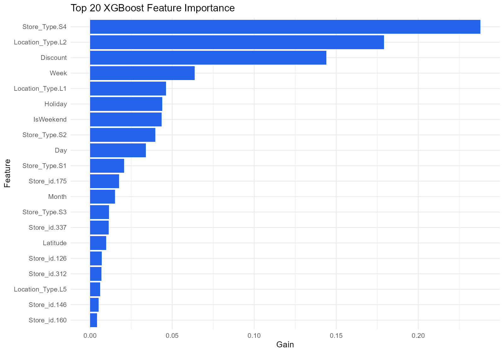
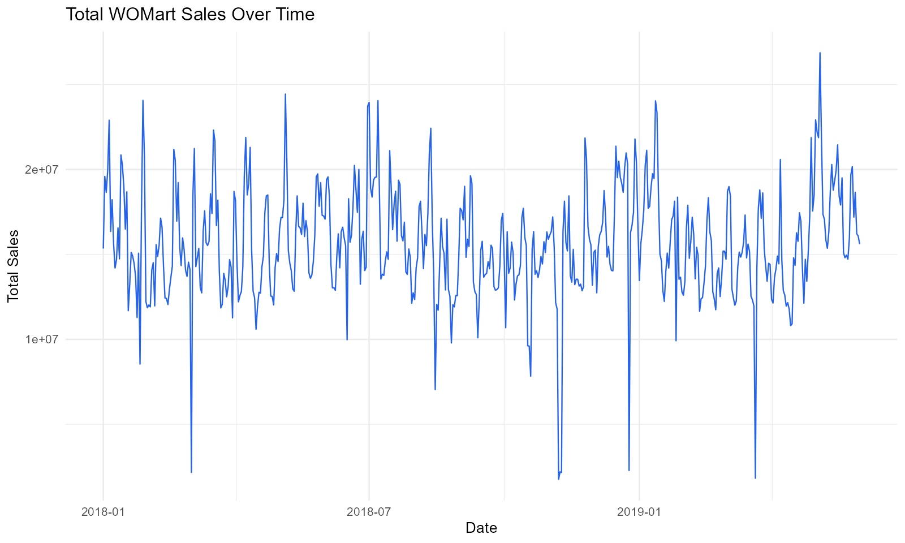
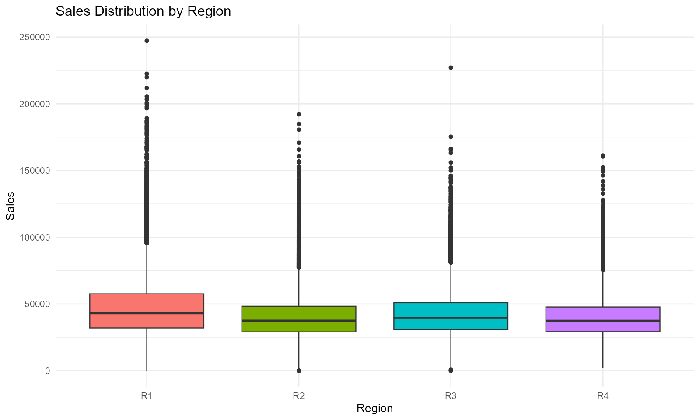
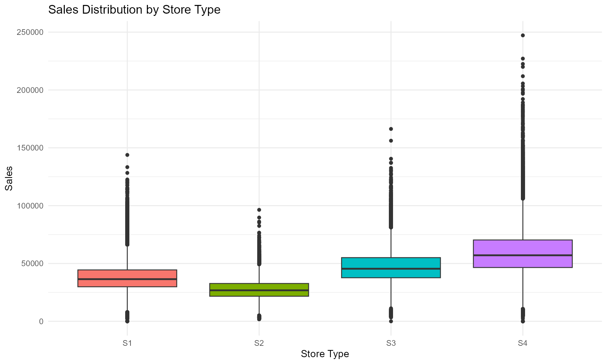

# GIS-Enhanced WOMart Sales Forecasting

Retail sales forecasting project extended into a GIS-enabled decision-support workflow. This capstone combines store-level demand forecasting, simulated spatial coordinates, regional segmentation, interactive Leaflet maps, and business-ready output files.



## Portfolio Summary

The original WOMart project forecasts daily sales across stores using historical sales, store attributes, discounts, holidays, and regional identifiers. This upgraded version adds a GIS layer so forecast results can be interpreted geographically. The work demonstrates transferable GIS experience through coordinate generation, spatial feature engineering, interactive map creation, regional demand summaries, and map-ready forecast outputs.

Because the dataset does not include real store latitude and longitude, the project uses reproducible simulated coordinates by region. The GIS outputs should be read as a spatial analytics demonstration, not as real WOMart store locations.

## Business Problem

Retail planners need to know not only how much demand to expect, but where demand is likely to concentrate. A conventional forecast table is useful, but a spatial forecast helps teams prioritize inventory, promotion planning, and monitoring by region and store location.

## What This Project Shows

- GIS-enhanced retail forecasting with simulated store coordinates
- Spatial feature engineering using distance-to-network-center logic
- Interactive Leaflet maps for store performance and forecasted demand
- XGBoost forecasting with store, region, time, discount, holiday, and GIS features
- Exported forecast CSVs, validation metrics, regional summaries, and map-ready outputs
- Clear business interpretation for inventory and regional planning

## Model Results

| Metric | Value |
| --- | ---: |
| RMSE | 9,279.50 |
| MAE | 6,523.38 |
| MSLE | 0.06897 |
| R-squared | 0.7521 |

The validation results show that the model captures a meaningful share of sales variation while still leaving room for improvement around unusual demand spikes and local volatility.

## Regional Forecast Summary

| Region | Avg Forecasted Sales | Avg Forecast Volatility | Store Count |
| --- | ---: | ---: | ---: |
| R1 | 49,584.02 | 7,901.85 | 124 |
| R3 | 44,827.20 | 7,553.39 | 86 |
| R2 | 42,666.11 | 6,837.97 | 105 |
| R4 | 42,443.76 | 6,742.81 | 50 |

R1 has the strongest average forecasted sales and should receive higher planning attention. Regions with stronger volatility may need buffer stock and closer monitoring.

## Key GIS Outputs

- [Rendered GIS report](report/WOMart-GIS-Sales-Forecasting.html)
- [Forecast output CSV](gis-outputs/GIS_WOMart_Forecast_Output.csv)
- [Historical store sales GIS map](gis-outputs/maps/store_sales_gis_map.html)
- [Forecast demand GIS map](gis-outputs/maps/forecast_sales_gis_map.html)
- [Model validation metrics](gis-outputs/tables/model_validation_metrics.csv)
- [Regional forecast summary](gis-outputs/tables/regional_forecast_summary.csv)
- [Feature importance table](gis-outputs/tables/feature_importance.csv)

## Visual Evidence

### Forecast Accuracy


The predicted values follow the overall sales pattern, with larger deviations around high-demand outliers.

### Feature Importance



Store type, location type, discount behavior, week, holidays, and spatial position contribute to the model's forecast signal.

### Demand Over Time



Sales show repeated spikes and dips over time, supporting the use of calendar and promotion-aware modeling.

### Regional and Store-Type Patterns





These plots show that demand differs by region and store format, which supports segmented planning instead of one-size-fits-all inventory decisions.

## Repository Structure

| Path | Contents |
| --- | --- |
| `data/` | Source CSV files for training, testing, and sample submission. |
| `rmarkdown/` | Improved GIS-enhanced R Markdown analysis. |
| `gis-outputs/` | Generated forecast CSV, plot PNGs, interactive maps, and summary tables. |
| `report/` | Rendered GIS HTML report and original capstone report PDF. |
| `presentation/` | Final capstone presentation. |
| `screenshots/` | Original dashboard screenshots and exploratory images. |

## Quick Start

1. Clone the repository.
2. Open R or RStudio from the repository root.
3. Install required packages:

```r
source("requirements.R")
```

4. Knit or run:

```r
rmarkdown::render("rmarkdown/WOMart-GIS-Sales-Forecasting.Rmd")
```

The notebook automatically detects whether the data folder is named `data` or `Sairam-Jammu-Capstone-Data`, so it can run from the GitHub repo or the original local project folder.

## Tools

R, tidyverse, lubridate, leaflet, htmlwidgets, caret, xgboost, ggplot2, DT, R Markdown, GIS feature engineering, and interactive map outputs.

## Business Takeaways

- Spatially enabled forecasts are easier for retail stakeholders to interpret than raw prediction tables.
- Region R1 has the strongest average forecasted demand in the generated forecast summary.
- Store type, location type, discounts, week, holiday behavior, and spatial coordinates all contribute to forecast performance.
- The output CSV can support GIS dashboards, BI tools, inventory planning, and regional prioritization.

## Author

Sairam Jammu  
M.S. Business Analytics, Kent State University
